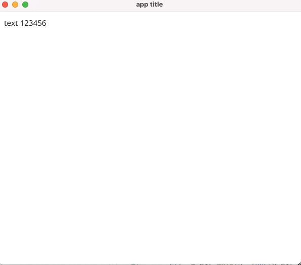
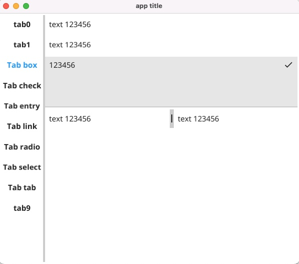

# NoCode UI

set UI by json config.
这是一个尝试，通过配置文件，从而零代码做UI

## example

1. edit(new) conf.json
   1. 创建一个conf.json文件，将以下内容存到文件中

        ```json
        {
            "title": "app title",
            "width": 600,
            "height": 500,
            "widget_id": "label1",
            "widgets": {
                "label1": {
                    "name": "",
                    "type": "label",
                    "id": "",
                    "value": "text 123456",
                    "place_holder": "place_holder",
                    "width": 0,
                    "height": 0
                }
            }
        }
        ```

   2. widget_id：整个app的起始的widget，该ID必须在widgets里面存在。
   3. widgets：用于定义各个要用到的模板
      1. label1就是模板id（普通字符串，没其他限制），定义后，其他的widget就可以通过id引用它
      2. widget的模板如下
         1. type: 该widget的类型，支持的类型可以查看后面的[帮助](#help)
         2. id: widget实例id，默认为空，有程序自动生成。如果设置，不允许重复（该模板就不能复用了）
         3. name/value/place_holder：不同的widget，作用不大一样，有些没用到
         4. width/height：该widget的大小，如果没设置，将使用自适应大小
         5. childs：当前widget包含的子元素，它是其他的widget模板id（radio/select的childs只是选项）
         6. 如果child不是widget，则需要设置ignore_child=true
         7. params：widget的其他参数信息，所有都是string

        ```json
        {
            "type": "tab",
            "id": "",
            "name": "",
            "value": "text 123456",
            "place_holder": "place_holder",
            "width": 0,
            "height": 0,
            "ignore_child": false,
            "childs": ["label","button","box","check","entry","link","radio","select","tab","icon"],
            "params": {
                "layout":"left",
                "auto_box":"true",
                "tab2":"Tab box",
                "tab3":"Tab check",
                "tab4":"Tab entry",
                "tab5":"Tab link",
                "tab6":"Tab radio",
                "tab7":"Tab select",
                "tab8":"Tab tab"
            }
        }
        ```

2. build

    ```bash
    go build
    ```

3. run ./nocode_ui



## demo

1. $./nocode_ui -demo
   1. 它会在本地生成一个demo_conf.json
   2. 将其修改名字为conf.json
2. 启动程序
   1. ./nocode_ui



## help

1. 查看支持的类型：

    ```bash
    % ./nocode_ui -show list
    widget type list:
    0: box
    1: button
    2: check
    3: entry
    4: icon
    5: label
    6: link
    7: radio
    8: select
    9: space
    10: split
    11: tab
    12: toolbar
    ```

2. 查看指定类型的说明：

    ```bash
    % ./nocode_ui -show radio
    type:radio
    describtion: new radio.
    ignore_child: must be true.
    childs: the items of radio.
    value: the selected item.
    ```
